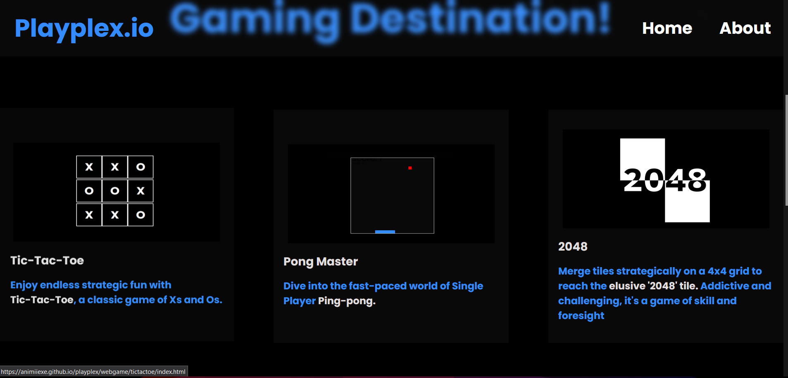

# [Playplex.io🎮](https://animiiexe.github.io/playplex/webgame/home/home.html)

## Table of Contents
1. [Introduction](#introduction)
2. [Features](#features)
3. [Installation](#installation)
4. [Usage](#usage)
5. [Game List](#game-list)
6. [Screenshots](#screenshots)
7. [Demo](#demo)
8. [Contributing](#contributing)
9. [License](#license)

## Introduction
Welcome to the Gaming Portal App! This app offers six exciting single-player games, providing hours of entertainment. Built with HTML, CSS, and JavaScript, it features a user-friendly interface and smooth gameplay experience.

## Features
- Six unique single-player games
- User-friendly interface
- High scores and achievements tracking
- Responsive design for desktop and mobile

## Installation
To get started with the Gaming Portal App, follow these steps:

1. Clone the repository:
    ```sh
    git clone https://github.com/animiiexe/playplex.git
    ```

2. Navigate to the project directory:
    ```sh
    cd playplex
    ```

3. Open the `index.html` file in your browser.

No additional setup is required.

## Usage
### Playing Games
1. Open the app in your browser.
2. Browse through the available games on the homepage.
3. Click on a game to start playing.
4. Enjoy the game and aim for high scores.

## Game List
Here are the six games available in the portal:

1. **Tic Tac Toe**
    Play the classic game of Tic Tac Toe against the computer or a friend. Strategize to get three of your marks in a row to win the game.
   

2. **Ping Pong**
 Enjoy a game of Ping Pong with simple controls and challenging AI. Use your paddle to hit the ball and outscore your opponent.
  

3. **2048**
    Combine tiles with the same numbers to reach 2048 in this addictive puzzle game. Each move merges tiles, so plan carefully.
   

4. **Snake**
   Control the snake to eat food, grow longer, and avoid running into walls or itself. The longer the snake, the higher the score.
   

5. **Matchmaker**
    Test your memory by matching pairs of cards within a time limit. The fewer moves you use, the better your score.


6. **Dino Game**
 Play the classic offline Dino Game, jumping over obstacles to achieve a high score. How far can you run?
     

## Screenshots


*Home Page*


*Game Library*


*About Us*

## Demo


## License
This project is licensed under the Apache 2.0 License - see the [LICENSE](LICENSE) file for details.

## Badges


